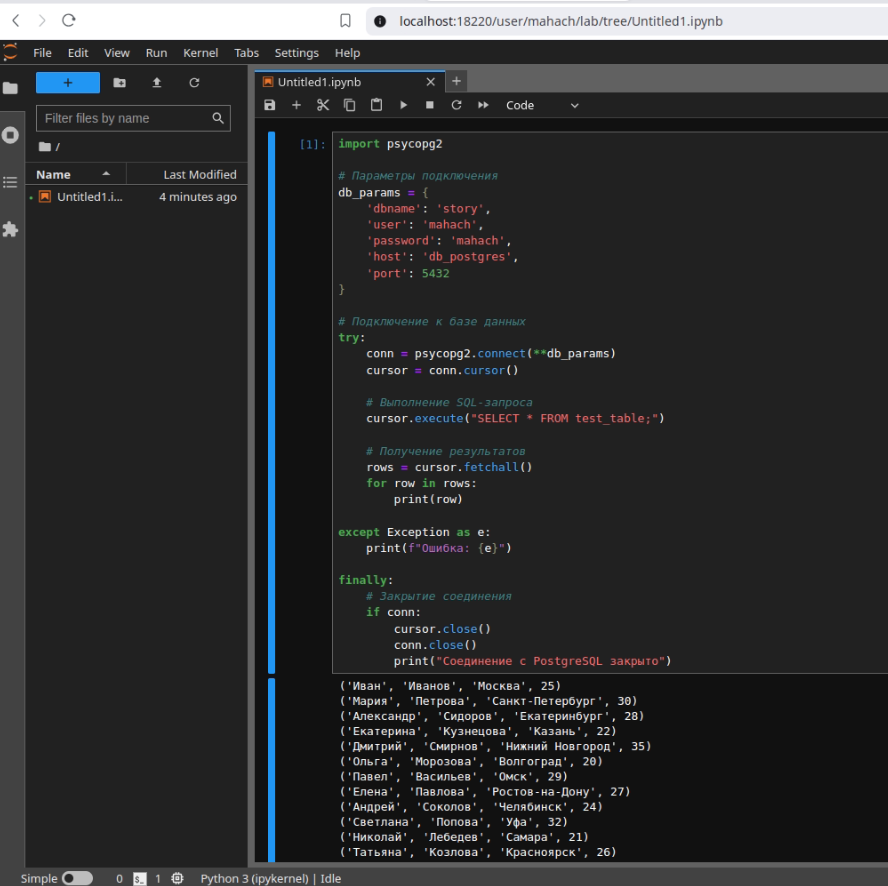

# Задание по установке jupyterhub с 3-мя jupyter notebook, установка postgres и доступ из jupyter notebook к нему.

## Jupyter
Для упрощения развертывания я сделал [баш скрипт](jupyterhub/deploy.sh).
Процесс развертывания jupyterhub включает в себя 2 этапа:
1. Идёт сборка образа jupyter notebook с необходимыми нам предустановленными библиотеками из следующего [dockerfile](jupyterhub/dockerfile.notebook).
2. С использованием [docker compose](jupyterhub/docker-compose.yml) идёт сборка jupyterhub из [dockerfile](jupyterhub/dockerfile) и [конфига jupyterhub](jupyterhub/config/jupyterhub_config.py)

## Postgres
Postgres устанавливаем командой `docker compose up -d` в директории нашего [docker compose](postgres/docker-compose.yml). Также для удобства тестрирования сразу создается таблица [файлом init.sql](postgres/init.sql)

## Jupyter Notebook + Postgres
После развертывания всех контейнеров и запуска jupyter notebook, мы можем проверить подключение к postgres используя [python скрипт](connect_to_postgres.py). Так как psycopg2 у нас предустановлен, отдельно его устанавливать в юпитер ноутбук не нужно.

